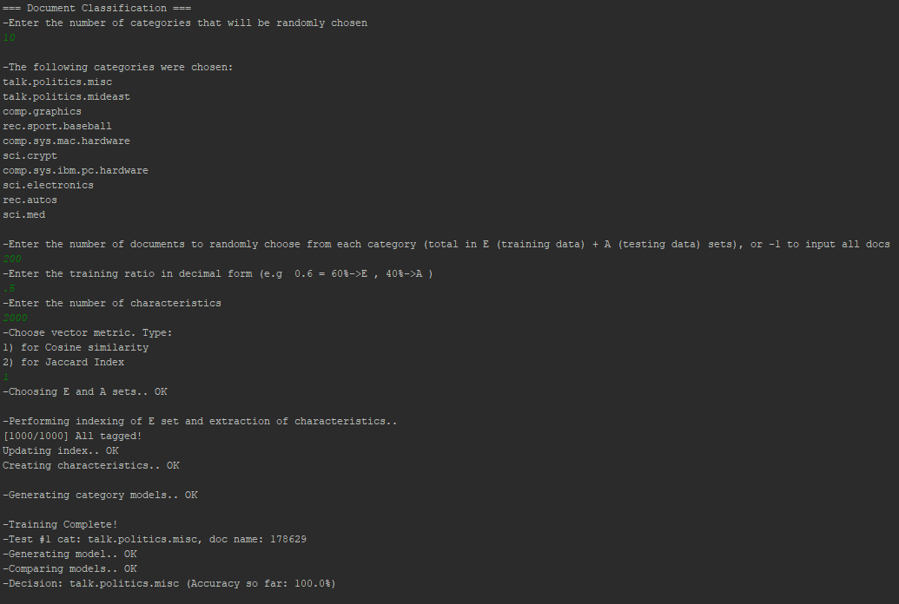

# 20 Newsgroups Text Classification

This is a classifier that trains on some of the documents from the categories of the [20 newsgroup dataset](http://qwone.com/~jason/20Newsgroups/) and tries to decide in which category it should place the rest of them. It was developed as part of the semester project in my Natural Language Processing class.

The classification process can vary in the number of the categories, the total number of documents, the train to test ratio, the number of characteristics(terms) to check, as well as the metric for the classification (Cosine similarity, Jaccard index).


## Installation & Usage

It has been tested on a Windows 10 environment with Python 3.6 installed using PyCharm IDE. The package requirements to run this, are listed in the ```requirements.txt``` file.

To run this, [download](http://qwone.com/~jason/20Newsgroups/) and place the extracted folder ```20news-19997``` at the root folder of the project. Then just execute ```main.py``` and the console will guide you through the process.


## Example


